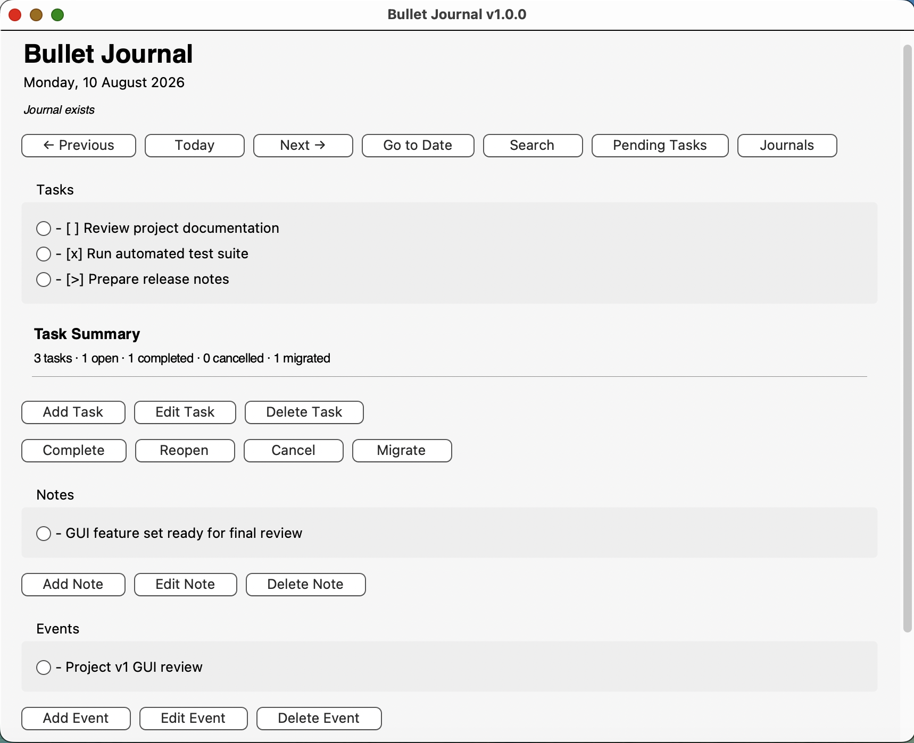

# Bullet Journal

A local-first Bullet Journal application written in Python, with both a graphical user interface and a command-line interface.

Journal data is stored as human-readable Markdown files on the local filesystem. The files remain portable, searchable and accessible without the application, avoiding dependence on a proprietary database or cloud service.

## Features

### Graphical interface



The Tkinter GUI provides:

* Create and browse daily journals
* Add, edit and delete tasks
* Complete, reopen, cancel and migrate tasks
* Add, edit and delete notes
* Add, edit and delete events
* Navigate between journal dates
* Jump directly to a specific date
* Browse all existing journals
* Search across journal files
* View pending tasks from multiple days
* Display task statistics for the current journal
* Restore journal backups
* Automatically create a journal only when content is first added
* Display journal availability/status
* Gracefully handle malformed journal files
* Scrollable journal view
* macOS trackpad and mouse-wheel support

### Command-line interface

The original CLI remains available and supports:

* Daily journal creation
* Task, note and event management
* Task migration
* Journal browsing
* Search
* Pending-task review
* Previous-day review
* Backup restoration
* Daily task statistics and completion progress

## Keyboard shortcuts

The GUI supports keyboard navigation on macOS, Linux and Windows.

| Action          | macOS     | Linux / Windows |
| --------------- | --------- | --------------- |
| Search journals | `Cmd + F` | `Ctrl + F`      |
| Previous day    | `Cmd + ←` | `Ctrl + ←`      |
| Next day        | `Cmd + →` | `Ctrl + →`      |

## Task markers

Tasks are stored using simple Markdown-compatible markers:

* `[ ]` Open task
* `[x]` Completed task
* `[-]` Cancelled task
* `[>]` Migrated task

For example:

```markdown
- [ ] Research project idea
- [x] Read documentation
- [-] Cancelled task
- [>] Migrated to another day
```

## Task summary

The application calculates task statistics for a journal.

The CLI displays a summary such as:

```text
Task summary:
Total: 4
Open: 2
Completed: 1
Cancelled: 0
Migrated: 1
Progress: [###-------] 33%
```

The GUI displays the same task states in a compact summary above the task controls.

Completion progress is calculated using open and completed tasks. Cancelled and migrated tasks are included in the total count but do not reduce completion progress.

## Journal format

Daily journals are stored in the `journal` directory using ISO-formatted filenames:

```text
2026-08-02.md
```

Each journal follows a deliberately simple structure:

```markdown
# Sunday, 02 August 2026

## Tasks

- [ ] Example task

## Notes

- Example note

## Events

- Example event
```

Markdown files are the source of truth. The GUI and CLI read and modify the same files.

## Backups

Before journal content is modified, the application maintains a backup of the previous journal state.

Backups use the `.bak` suffix:

```text
2026-08-02.md
2026-08-02.md.bak
```

Backups can be restored from either the CLI or GUI.

## Requirements

* Python 3.12 or later
* Tkinter for the graphical interface
* No third-party Python packages are required for normal operation

Tkinter is included with many Python installations, although some Linux distributions may package it separately.

## Installing from a wheel

Build the package with:

```bash
python3 -m build
````

This creates distribution files in the `dist/` directory, including a platform-independent Python wheel such as:

```text
bullet_journal-1.1.0-py3-none-any.whl
```

Install the wheel with:

```bash
python3 -m pip install dist/bullet_journal-1.1.0-py3-none-any.whl
```

After installation, launch the command-line interface with:

```bash
bullet-journal
```

or the graphical interface with:

```bash
bullet-journal-gui
```

## Running the graphical interface

From the project directory:

```bash
python3 gui.py
```

## Running the command-line interface

The original CLI remains available:

```bash
python3 main.py
```

Both interfaces operate on the same Markdown journal files.

## Journal data location

Journal files are stored in an operating-system-specific application data directory.

Typical locations are:

```text
macOS:
~/Library/Application Support/BulletJournal/journal/

Windows:
%APPDATA%\BulletJournal\journal\

Linux:
~/.local/share/BulletJournal/journal/
```

On Linux, the `XDG_DATA_HOME` environment variable is respected when configured.

The graphical interface includes an **Open Journal Folder** action for opening the active journal storage directory directly in Finder, File Explorer or the Linux file manager.

## Exporting journals

The graphical interface includes an **Export Journals** action.

It creates a ZIP archive containing the Markdown journal files, making it easy to:

* create manual backups
* transfer journals between computers
* archive journal history
* move the data independently of the application

The Markdown files remain the source of truth and can be read without Bullet Journal.

## Cross-platform desktop builds

The application can also be packaged as a standalone desktop application using PyInstaller.

GitHub Actions builds the application automatically for:

* macOS
* Windows
* Linux

The workflow runs the automated test suite before packaging and produces downloadable build artifacts for each operating system.

Typical artifacts include:

```text
BulletJournal-macOS
BulletJournal-Windows
BulletJournal-Linux
```

The macOS artifact contains a `.app` bundle, the Windows build produces a `.exe`, and the Linux build produces a standalone executable.

The same Python source code and Markdown journal format are shared across all platforms. Platform-specific behaviour is limited to storage paths and distribution packaging.

### macOS Gatekeeper

Current development builds are not code-signed or notarized.

macOS may therefore display a Gatekeeper warning when opening a downloaded build. During development and testing, the application can be allowed manually from **System Settings → Privacy & Security**.

Code signing and notarization are planned as release-hardening steps for future public distribution.

## Running the tests

Run the complete test suite:

```bash
python3 -m unittest -b
```

Run the tests in verbose mode:

```bash
python3 -m unittest -v
```

The current automated test suite contains **125 tests** covering journal parsing, storage, task and entry actions, terminal behaviour, journal queries, platform-specific paths and journal export.

## Project structure

```text
bullet-journal/
├── bullet_journal/
│   ├── __init__.py
│   ├── app.py
│   ├── entry_actions.py
│   ├── export_actions.py
│   ├── gui.py
│   ├── gui_backup_actions.py
│   ├── gui_event_actions.py
│   ├── gui_helpers.py
│   ├── gui_note_actions.py
│   ├── gui_task_actions.py
│   ├── journal_actions.py
│   ├── journal_parser.py
│   ├── journal_queries.py
│   ├── journal_storage.py
│   ├── paths.py
│   ├── task_actions.py
│   ├── terminal_ui.py
│   └── version.py
├── .github/
│   └── workflows/
│       └── build-desktop.yml
├── gui.py
├── main.py
├── test_entry_actions.py
├── test_export_actions.py
├── test_journal_actions.py
├── test_journal_parser.py
├── test_journal_queries.py
├── test_journal_storage.py
├── test_paths.py
├── test_task_actions.py
├── test_terminal_ui.py
├── test_version.py
├── CHANGELOG.md
├── pyproject.toml
└── README.md
```


## Design principles

The project follows several deliberate design principles:

* **Local first** — journal data remains on the user's filesystem.
* **Portable data** — Markdown files can be read and edited without the application.
* **Simple storage** — no database is required.
* **Shared data model** — the CLI and GUI operate on the same journal files.
* **Separation of concerns** — parsing, storage, queries, terminal behaviour and GUI actions are separated into focused modules.
* **Defensive file handling** — journal changes are backed up and malformed journals are handled without terminating the GUI.
* **Testability** — core behaviour is protected by automated unit tests.
* **Minimal dependencies** — the application relies primarily on the Python standard library.

## Development status

The project began as a command-line Bullet Journal application and has since been extended with a Tkinter graphical interface.

The CLI provides the original stable workflow, while the GUI now exposes the main journal-management functionality through a desktop interface.

The next development stage is focused primarily on release polish, documentation and distribution rather than adding major core features.
